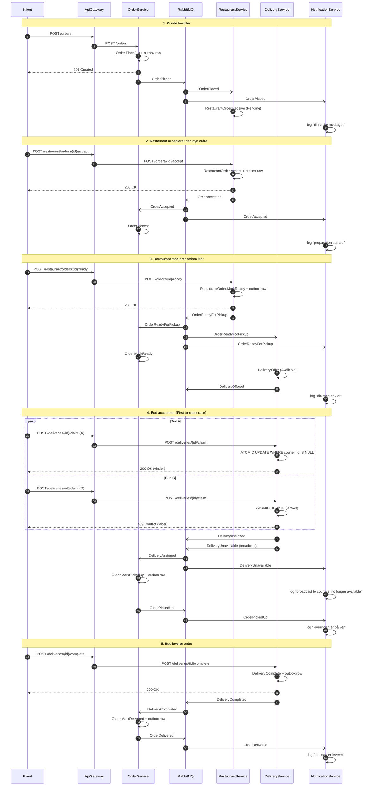

# Eaat — Event Flow 

Sekvensdiagram der viser det fule flow lige fra kunder er lægger en ordre til at leveringen er fuldført.

**OBS**: Nedunder ses udelukkende mermaid kode for de forskellige diagrammer. De kan loades i al mermaid software som f.eks. [mermaid.live](https://mermaid-js.github.io/mermaid-live-editor/). 
Ellers findes diagrammerne også i images mappen i samme diagrams folder.

