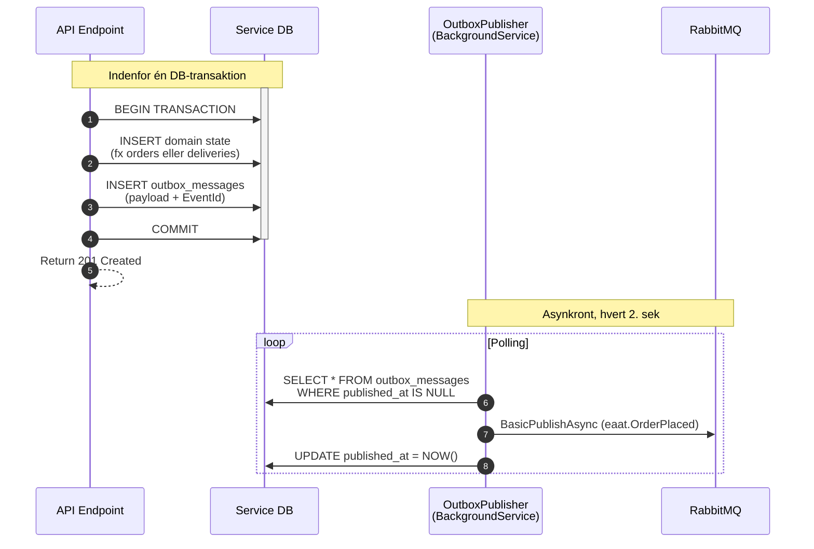
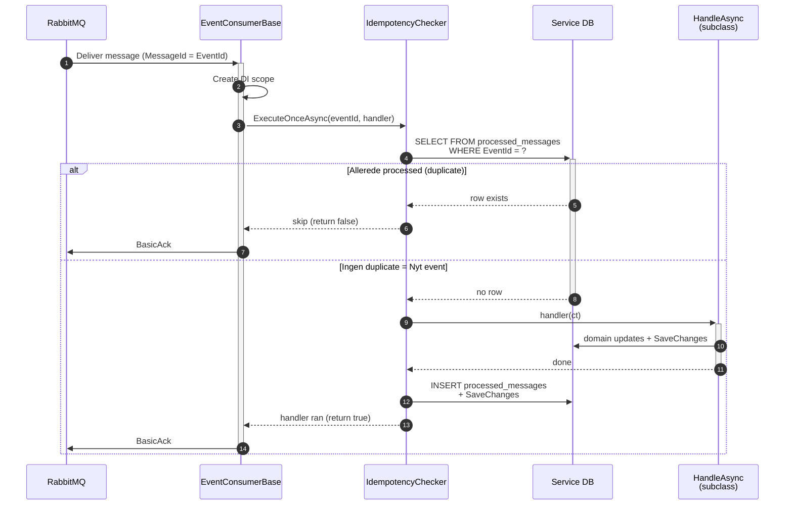
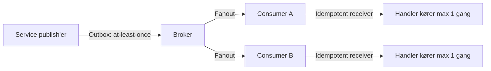
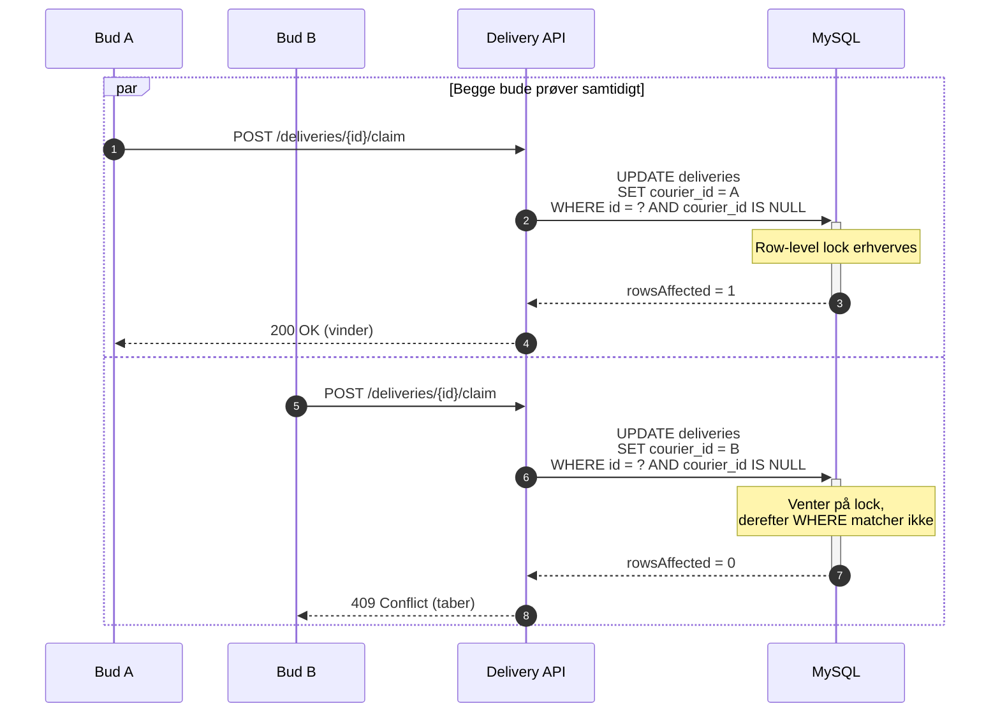

# Eaat — Outbox Pattern + Idempotent Receivers

To mønstre som arbejder sammen for at sikre exactly-once processing samt at-least-once delivery.

**OBS**: Nedunder ses udelukkende mermaid kode for de forskellige diagrammer. De kan loades i al mermaid software som f.eks. [mermaid.live](https://mermaid-js.github.io/mermaid-live-editor/).
Ellers findes diagrammerne også i images mappen i samme diagrams folder.

## Outbox-pattern

## Idempotent receivers 

## Tilsammen: effektivt exactly-once-processing

## First-to-claim logik

